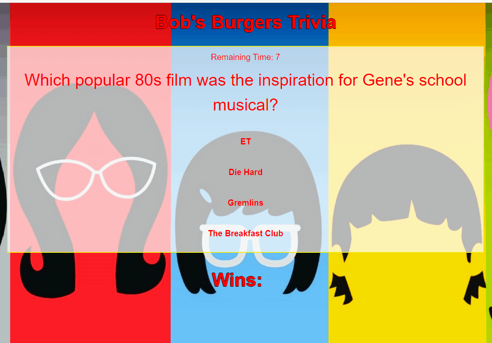
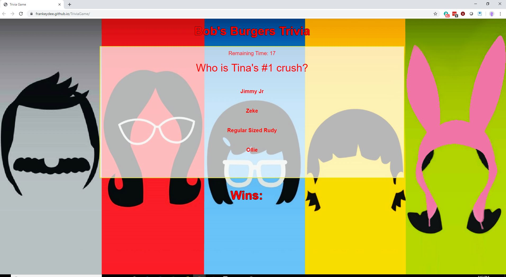
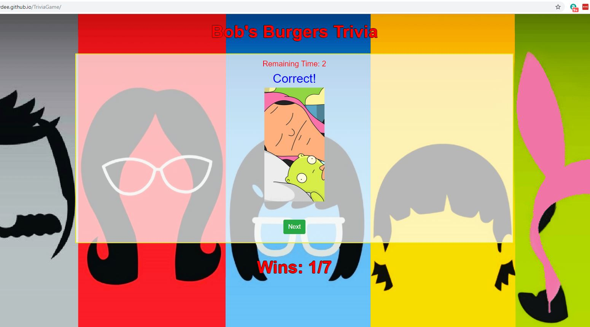

# TriviaGame - Bob's Burgers

I wanted to create a Trivia Game based on my favorite show: Bob's Burgers. This game gives the user the ability to go through a quiz and select when to 'Start' with a green 'Start' button. Questions are then displayed one by one, randomly, as the counter at the top counts down in seconds. Clicking on an answer will either produce a message letting the user know that they have chosen the correct answer or a message that says they have failed. Each message is also accompanied by an image or a GIF re-iterating the correct answer to the latest question.
</gif>

The background was a simple wallpaper of the main cast: Bob, Linda, Tina, Eugene and Louise Belcher. The center of the page displays a container where the trivia questions and answers are displayed on top of a white background with adjusted opacity. 

</img> </img>

Improvements:
  - More styling on the title, fonts, remaining time and score counter
  - Bug to fix: the first question, although randomized, always displays the correct answer for the first item in the array
  - Create more interactive styling or animation to make the game more fun

https://frankeydee.github.io/TriviaGame/
